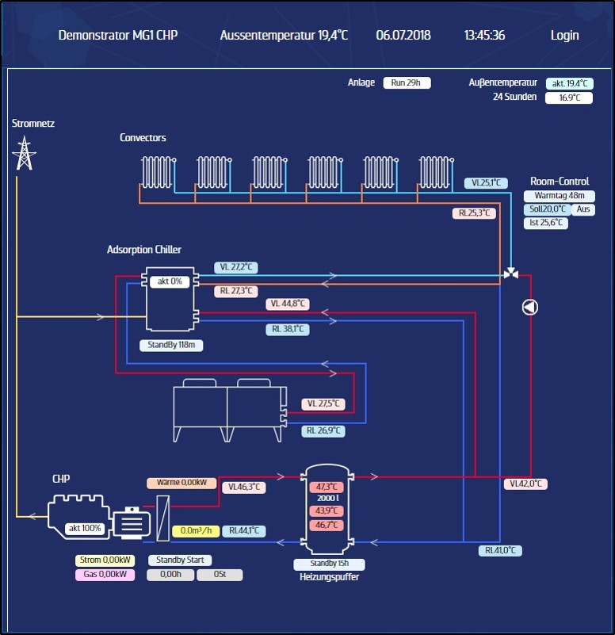

# 3.Microgrid of Reutlingen University

evtl. noch Bild aus Skript einfügen

The Microgrid of the Reutlinger University consits of four components, which can be divided into following categories:

Generation of electricity or/and heat:
 - PV-System: There are 5 PV-Systems with 6 modules each. The total output of PV-generation is 10,2 kWpeak. However the generation from PV               is dependent on weather conditions.
 - CHP-Unit (Combined heat and power): The output of the CHP-Unit is 20 kWhel and 44 kWhth and is in contrast to the PV-System constant in               and adjustubale to the needs of the Microgrid. 

Energy Storage: 
 - Battery: The Battery in the Microgrid has a total capacity of 12 kWhel. But only 80% of the capacity are usuable, which equals to 9,6               kWhel.
 
 Loads:
  - There are 5 consumers in the Microgrid, which have a demand of 10.000 kWhth and 25.000 KWhel of energy per year.
  
  Furthermore the Micogrid is connected to the Utility Grid and can receive or sell electricity to it.
