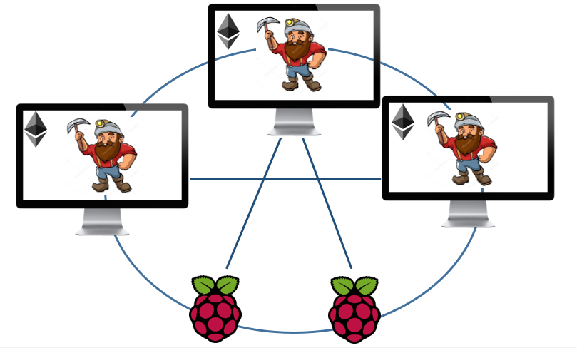

# 5. Physical implementation in a Test Network

## 5. Physical implementation in a Test Network

The network setup for testing the physical implementation is based on the [component layer](https://hsrt.gitbook.io/dee-scm/~/edit/drafts/-LHSQz-rd4nzauq3xkN0/4.-llustration-of-the-business-model-in-the-sgam#4-3-component-layer) described in the previous chapter. In total five nodes represent the Load, the PV-System \(Photovoltaic System\), the CHP-Unit \(Combined Heat and  Power Unit\), the Battery-System and the Utility-Grid. The [blockchain ](https://hsrt.gitbook.io/dee-scm/~/edit/drafts/-LHSQz-rd4nzauq3xkN0/2.-theoretical-background#2-2-blockchain-technology)is established between these actors. For this purpose three of them are active miners and two of them are passive nodes. Powerful laptops are used for the miners, while Raspberry Pi´s are used for the nodes. Since the goal is to show, that the implementation of the blockchain in this scenario is possible, the focus is on a proof of work. The central aspect of this implementation is the communication between the different nodes in form of a smart contract.


**Combined Heat and Power \(CHP\):** CHP is a heat engine that generates electricity.



**Load:** Load is an electrical component that consumes energy.



**Grid:** A Grid is an interconnected network for delivering electricity.



**Battery:** A battery can store and emit electrical energy due to its electrochemical cells.



**Photovoltaics \(Pv\):** A Pv-System can turn light into electricity.


### 5.1 Minimum Viable Product

 The Minimum Viable Product \(MVP\) can be derived from the precious assumption, that the central aspect is the communication between the nodes. Since the technical concept has a broad scope, the MVP got split up into two parts. The fundamental starting point for both aspects is the construction of the private \(permissioned\) blockchain based on the three miners and the two nodes. Based on this, the first step in the MVP is to develop a [smart contract](https://hsrt.gitbook.io/dee-scm/~/edit/drafts/-LHSQz-rd4nzauq3xkN0/2.-theoretical-background#2-4-smart-contracts) with different methods to enable the communication between the nodes. This includes methods to offer amounts of energy by supply nodes, methods to buy the offered energy by demand nodes and the transfer of ether between the involved parties. The second part of the MVP is to include the data generated by the Matlab simulation. The previously developed smart contract should be deployed with the provided data and automatically executed between the best fitting parties, with regards to offered amount and cheapest price.

The MVP is visualized in the following figure. Because of the broad scope, the focus lies on the basis and the first part of the MVP in this [hackathon ](https://hsrt.gitbook.io/dee-scm/~/edit/drafts/-LHSQz-rd4nzauq3xkN0/2.-theoretical-background#2-1-hackathon)\(illustrated in green in the figure\). 

### 5.2 **Used Hardware**

For testing, three laptops were set up as miners and two Raspberry Pi 3 as nodes. 

### 5.2.1 Install an Ethereum node on a Raspberry Pi

Raspberry Pis were chosen because they are cheap and easy to set up compared to laptops or computers. Also, the computing power should be sufficient to operate a node.

The Raspberry Pi has been assembled according to the instructions included in the box and has a USB mouse and USB keyboard connected. A screen was connected via HDMI cable and a LAN cable was plugged in. After the installation they were operated via WLAN.

The installation of the Raspberrys was done according to the instructions of [ChainSkills](http://chainskills.com/2017/02/24/create-a-private-ethereum-blockchain-with-iot-devices-16/). This series of tutorials describes how to set up a private Ethereum blockchain that will be composed of a computer \(miner\) and one or several Raspberry PI 3 devices \(nodes\).

The setup of the Raspberry Pi requires the following hardware:

* A Raspberry Pi
* An SD Card with at least 16Gb
* A LAN cable
* A keyboard
* A display

**Steps to perform**

* Format the SD-Card in FAT32.
* Download the Raspbian image and write it to the SD-Card using [Etcher](https://etcher.io/).
* Make our preferred adjustments \(language, tastatur layout, Wi-Fi, SSH\).
* Connect via PuTTY.
* Install and run [Geth](https://geth.ethereum.org/downloads/).

### 5.2.2 Install an Ethereum miner on a computer and initializing the blockchain

For the installation of the Ethereum miners on Windows computers, the instruction of [ChainSkills](http://chainskills.com/2017/03/03/install-a-ethereum-node-on-a-computer-26/) can be followed. 

**Steps to perform**

* Installation of [Geth ](https://geth.ethereum.org/downloads/)
* Initialization of a private Blockchain with our [genesis.json](https://github.com/Ricardo-Cz/DEE_SCM/blob/master/genesis.json) file for each miner.
* Creation of accounts for each miner and node.
* Preparation of each miner with our [start parameters](https://github.com/Ricardo-Cz/DEE_SCM/blob/master/startminer1.bat).
* Testing of each miner.
* Deleting the private Blockchain of each miner.
* Pairing and synchronizing of the three miners by configuring our [static-nodes.json](https://github.com/Ricardo-Cz/DEE_SCM/blob/master/static-nodes.json) parameters. \(Hardest step.\)
* Pairing and Synchronizing the Raspberry PIs with our miners by configuring our [static-nodes.json ](https://github.com/Ricardo-Cz/DEE_SCM/blob/master/static-nodes.json)parameters.
* Connecting to our mining network via [Mist browser](https://github.com/ethereum/mist).


**Blockchain Type:** The network is established as a private or permissioned Ethereum blockchain.        



 **Number of nodes:** In total there are five nodes; two of them are passive nodes, three of them are active miners.



**Node implementation:** The nodes are written in Go, because Geth was used for the node creation. There are other node implementation languages, but Go is the most resilient one.



**Consensus:** The focus is on a proof of work to show the possibility of the implementation in the given business use case.



Please be aware, that the genesis.json, the start parameters and the static-nodes.json have to be modified so that they fit your needs.


## 

