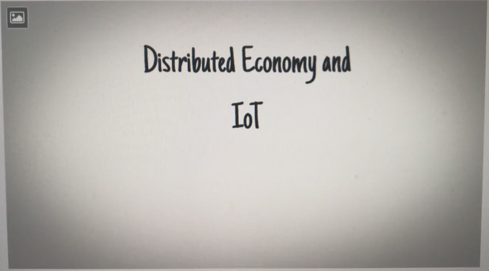

# 7. Conclusion

## 7. Conclusion

### 7.1 Achievment of Objectives and Future Tasks

The chapter "[Physical implementation in a Test Network](5.-physical-implementation-in-a-test-network.md#5-physical-implementation-in-a-test-network)" shows how the basis of the [MVP ](5.-physical-implementation-in-a-test-network.md#5-1-minimum-viable-product)was built up. We were able to set up the private Ehereum blockchain with two nodes and three miners at the beginning of the [hackathon ](2.-theoretical-background.md#2-1-hackathon)and to ensure the communication. The sample scenario in the [previous chapter](6.-structure-of-the-smart-contract.md#6-1-sample-scenario) shows how far the technical implementation of the MVP has come during the course of the hackathon. The sample scenario was implemented and it is possible to comprehend which party buys energy from which provider. Furthermore, it can be seen from the screenshots and the sequence diagram, that the functions related to the transfer of the ether could be implemented as well. Thus, the first part of the MVP has been implemented. It is safe to say, that the team could reach their set goal.

In order to implement all requirements, the second part of the MVP would have to be analyzed in more detail, implemented and tested. This was not done during the hackathon, but remains as a future task.

The Matlab model that should be used looks like this:

The goal of the model is to calculate and provide the enery offer or demand from every component. The grid and the battery can can provide or consume energy, hence they are the only two components that can have positive and negative values. The Matlab model is designed to generate every 15 seconds the energy data that represent the intended energy data of 24 hours. The energy data include the amount of energy in kWh and the price in euro/kWh.

The next step would be to install Matlab and make use of the already existing model. The generated data should be extracted and implemented in the deployed smart contract. A possible transmission approach is using the User Datagram Protocol \(UDP\). This functionality can be applied in the Packet Output block in the top middle of the Matlab model. For the output block the timing, the output size, the data type, the host name and the UDP port can be configured. How exactly the Packet Output block should be configured and how the output data can be used by the nodes has to be examined further. A possible option is to make use of a small Java program that transforms the data and calls the methods of the smart contract with the transformed data.

### 7.2 Reflection

During the course of the hackathon, we stumbled across various problems or obstacles. One of them is, that the given use case is very complex and the only ones having previous knowledge about the energy sector were the students working on the business use case and its documentation. This made the implementation and the communication between the teams very difficult and misleading. It was hard to create a common understanding and a basis everybody could start from, because the business students did not have knowledge about the technical aspects. Another problem we encountert was regarding the available hardware. Since the miners need a lot of ressources, we decided to run them on our laptops. However the laptops were fully occupied by the miners, altough some of the laptops were running in the newest and currently most powerful i5 processors. Because of this, three of our team members could not work properly while the blockchain was running, and that at the already very tight time. Since we were able to estimate at the beginning that the time is closely calculated, we had to divide the MVP into two parts of which we only could work on one. The fact that three laptops were running the blockchain did contribute to the time running out before we could start with working on the second part of the MVP.

### 7.3 Presentation and Video

A short video about the project can be found here:

A short powerpoint presentation about the project can be found here:

{% embed data="{\"url\":\"https://github.com/Ricardo-Cz/DEE\_SCM/blob/master/Hackathon%20DEE.pptx\",\"type\":\"link\",\"title\":\"Ricardo-Cz/DEE\_SCM\",\"description\":\"Contribute to DEE\_SCM development by creating an account on GitHub.\",\"icon\":{\"type\":\"icon\",\"url\":\"https://github.com/fluidicon.png\",\"aspectRatio\":0},\"thumbnail\":{\"type\":\"thumbnail\",\"url\":\"https://avatars1.githubusercontent.com/u/35137273?s=400&v=4\",\"width\":420,\"height\":420,\"aspectRatio\":1}}" %}

