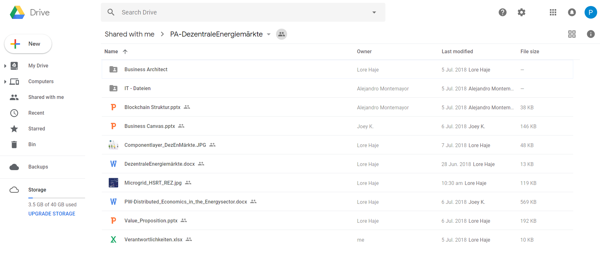

# 1. Introduction

## 1. Introduction

Since Bitcoin hit the € 15,000 mark in December 2017, cryptocurrencies and the blockchain are gaining more and more popularity. Companies and research institutes are increasingly devoting themselves to the new technology in order to take advantage of their benefits. The energy sector can also benefit from the peculiarities of the blockchain. These include lower transaction costs, increased resilience, privacy and authenticity.

The goal of this [hackathon ](https://hsrt.gitbook.io/dee-scm/~/edit/drafts/-LHJ1-JCH1Ve9ueapP2N/2.-theoretical-background#2-1-hackathon)is to show the technical feasibility of [Bockchain ](https://hsrt.gitbook.io/dee-scm/~/edit/drafts/-LHJ1-JCH1Ve9ueapP2N/2.-theoretical-background#2-2-blockchain-technology)based P2P transactions in a use case of the energy industry and thus make the advantages mentioned tangible.

### 1.1 Project task and Expectations

The task of the project was to build a private Ethereum [Blockchain ](https://hsrt.gitbook.io/dee-scm/~/edit/drafts/-LHJ1-JCH1Ve9ueapP2N/2.-theoretical-background#2-2-blockchain-technology)with five nodes and operate it in the context of a business case from the energy industry. The five nodes represent actors in the energy industry. The exemplary network receives data on the capacity and cost of electricity from a Matlab simulation. Based on these data, a smart contract has to be concluded between the actors.

### 1.2 Team

**Projectmanagement, Documentation and Team Support**

The project management must plan and organize the actions of the entire group, allocate task packages and ensure communication between the business and the technical perspective. In addition, the project management has supported in the documentation and the technical implementation due to the scarce capacity. Philipp Noack and Jan Niclas Weiss were responsible for this task.

**Business Case and Business Documentation**

The Business Case and Business Documentation group is responsible for creating the high level business case and its documentation. Various models are created for this purpose, such as the Business Model Canvas, Activity Diagram, Use Case Diagrams, Sequence Diagram and Value Proposition Canvas. They describe the starting position and the overall idea on which the implementation of the project is based. These assignments were done and documented in the following chapters by Lorenz Hajek, Patrick Klyeisen and Joey Kiefer.

**Technical implementation and Documentation**

Members of the Technical Implementation and Documentation group are responsible for implementing the scenarios created by the Business Case and Business Documentation group with appropriate technologies and resources. This requires setting up a blockchain, ensuring communication between the nodes and miners, and creating a smart contract. The procedure for implementation is documented in the following chapters. Ricardo Czernotzky and Mustafa Satin are responsible for this.

**Video creation and Presentation**

For a better understanding a short explanatory video and a presentation has to be prepared, which will be presented at the end of the hackathon. These files include the scenario and the chosen approach explained in an understandable manner. Rabia Karatas and Waleri Janzen are responsible for this.

####  Cross section functions

To support the team, an expert is available, who has already worked in the topic before the event. This helps mainly in the technical implementation, but also in the communication between the technically oriented and the business-oriented team. Alejandro Montemayor was responsible for this.

### 1.3 Conceptual idea

The following figure shows the basic concept of the smart contract in the use case environment. The programmed and deployed [Smart Contract](https://hsrt.gitbook.io/dee-scm/~/edit/drafts/-LHJ1-JCH1Ve9ueapP2N/2.-theoretical-background#2-4-smart-contracts) will be enriched with supply and demand data from the Matlab simulation \(1\). Then the [Smart Contract](https://hsrt.gitbook.io/dee-scm/~/edit/drafts/-LHJ1-JCH1Ve9ueapP2N/2.-theoretical-background#2-4-smart-contracts) is written to the [blockchain ](https://hsrt.gitbook.io/dee-scm/~/edit/drafts/-LHJ1-JCH1Ve9ueapP2N/2.-theoretical-background#2-2-blockchain-technology)\(2\) and gets verified from each node \(3\). After the successful verification by the network, the transaction gets executed \(4\), which means that the electricity purchased by the customer gets paid in ether and the appropriate amount of electricity is made available to him \(5\).

### 1.4 Method

The project will be processed as part of a [hackathon](https://dee-scm-blockchain-project.gitbook.io/dee-scm/~/drafts/-LH4UOL87dGd8p-YwPUF/primary/2.-theoretical-background#2-1-hackathon). The course of a [hackathon ](https://dee-scm-blockchain-project.gitbook.io/dee-scm/~/drafts/-LH4UOL87dGd8p-YwPUF/primary/2.-theoretical-background#2-1-hackathon)will be explained in the following chapter. It is an agile learning method in the context of a temporary laboratory. Here, responsibilities for the project process are defined and tasks assigned. These tasks and responsibilities adapt to the current situation and overlap.

The principles of this agile learning method can be derived from the so-called agile principles of the "Agile Manifesto". An excerpt from this is the rapid provision, continuity of learning, cross-functional learning and communication, as well as the formation of learning teams, the achievement of learning successes in everyday operations and the reflection. These principles are already fulfilled by the nature of a [hackathon](https://dee-scm-blockchain-project.gitbook.io/dee-scm/~/drafts/-LH4UOL87dGd8p-YwPUF/primary/2.-theoretical-background#2-1-hackathon).

On the individual days of the [hackathon](https://dee-scm-blockchain-project.gitbook.io/dee-scm/~/drafts/-LH4UOL87dGd8p-YwPUF/primary/2.-theoretical-background#2-1-hackathon), the following tasks were revised:

**Preparation Meeting**

* set up Google Drive
* set up Whatsapp Group
* set up Trello board
* team-discovery 
* role allocation 
* creating a common understanding of the task 
* task distribution
*  set up Gitbook-Project

**Hackathon Day 1**

* detailed task distribution
* set up private blockchain \(set up raspberry, set up miner\) 
* create business diagrams
*  define Minimum Viable Product 
* Smart Contract Programming 
* start work on the documentation

**Hackathon Day 2**

* Smart Contract completion 
* testing the implementation 
* creation of a video
* further work on the documentation 
* preparing the final presentation and conclusion

### 1.5 Project organization

**Trello**

To support the project organization, the web-based project management software Trello was used. The first tasks were entered at the beginning, which were gradually expanded. In addition, the responsibilities were stored there and the status of the tasks was tracked.

#### W**hatsApp**

For the short-term communication and the rapid exchange of information, a Whatsapp group was created.

**Google Drive**

For the exchange of large documents, files and created diagrams of the DEE students, a Google Drive folder has been set up.

